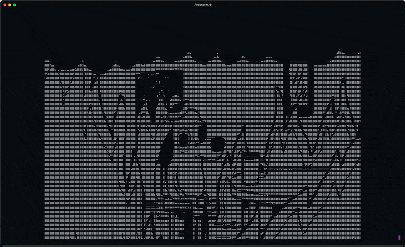

<h1 align="center"><code>webterm</code></h1>

A shitty ASCII web browser for your terminal.

Ever wanted to browse the web as if it were the 1980s? Then webterm is the browser for you.
It features:

- Scrolling in x and y axes ↕️
- Braille mode for 8x resolution super sampling! `⠁`
- 8-bit colors 🌈
- Cursor support for interacting with the webpage 🖱️ (coming soon)

`Disclaimer: It may crash, burn and mess up your terminal's color palette :)`
